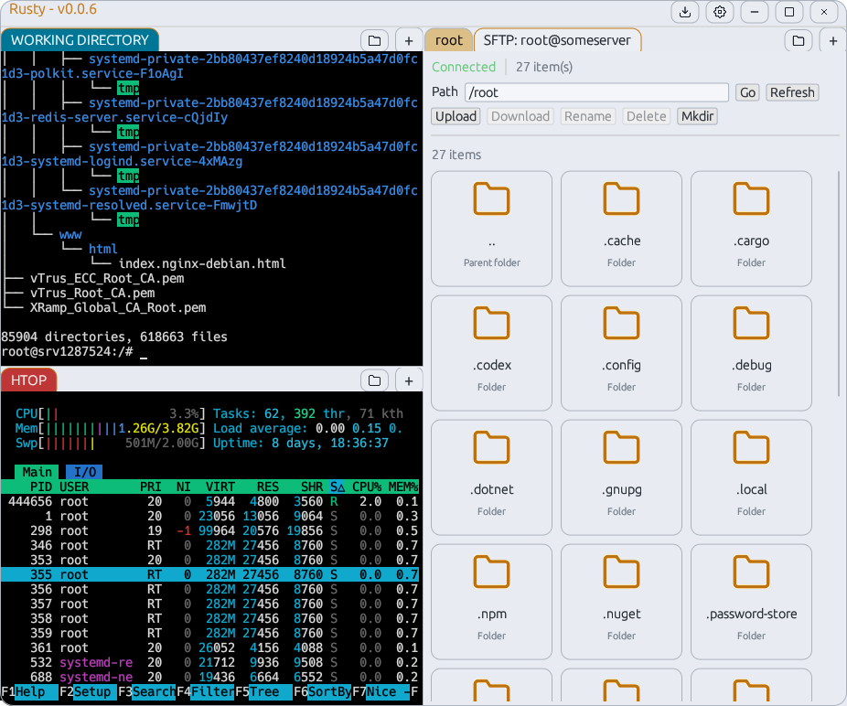
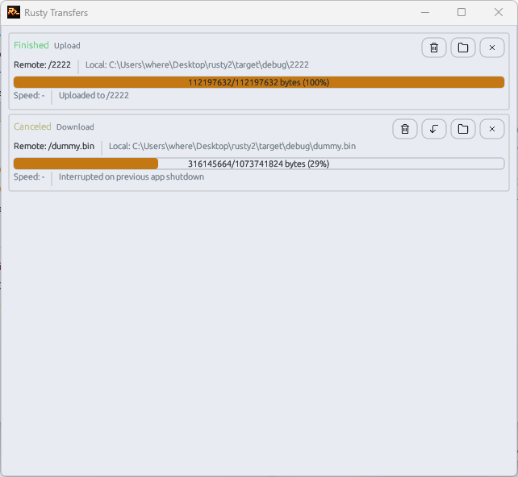

# Rusty

Rusty is a Windows desktop SSH client built in Rust with color-coded organizational features, split-pane tabbed terminals, an integrated SFTP file browser, and a global transfer manager.

- Theme file format guide: [THEMES.md](THEMES.md)

## Screenshots

<p align="center">
  
  
  
</p>

## Features

### SSH and authentication
- Password authentication.
- Public key authentication (including key passphrase prompt/save).
- Keyboard-interactive authentication.
- `ssh-agent` authentication support.
- PTY shell with `TERM=xterm-256color`.
- Keepalive (20s) and per-session logs in `logs/tab-<id>.log`.
- Host key verification against `%USERPROFILE%\\.ssh\\known_hosts`.
- Unknown host key trust prompt (`Trust & Save` / `Reject`).

### Terminal
- Embedded VT terminal rendering (xterm/VT100).
- ANSI colors (16 + 256) with configurable terminal palette.
- Adjustable scrollback (default 5000, up to 200,000).
- Mouse wheel + draggable scrollbar for scrollback.
- Selection across visible content and scrollback.
- Copy/paste shortcuts plus right-click paste.
- Bracketed paste when supported by the remote app.
- Focus lock for terminal keys (tab/arrows/escape).
- Active terminal highlighting and optional inactive-pane dimming.

### SFTP file browser
- Opens in its own dedicated connection per file manager tab.
- Open from tab menu (`Open File Manager`) or pane folder button.
- Directory navigation (`Go`, `Refresh`, parent folder).
- Upload and download from the current remote directory.
- Remote folder create (`Mkdir`), rename, and delete.
- File/folder card view with right-click actions.

### Global transfer manager
- Separate transfers window (not docked).
- Unified upload/download queue and history.
- Per-transfer status, progress, speed, and message.
- Retry flow with automatic backoff for transient failures.
- Pause state after retry exhaustion (manual retry available).
- Cancel, retry, remove-history, and open-containing-folder actions.
- Delete flow with confirmation (downloads can remove local file).

### Tabs, panes, and layout
- Multi-tab SSH sessions.
- Split panes (right/down) with dockable layout (`egui_tiles`).
- New tab from active tab settings or from saved profile (`+` menu).
- Tab context menu: connect/disconnect, rename, color, split, close.
- Optional session layout save/restore.

### Settings and profiles
- Settings window sections:
  - Autostart
  - Behavior
  - Appearance
  - Terminal Colors
  - Profiles and Account
- Profile create/edit/save/delete with default profile support.
- Optional saved password and key passphrase per profile.
- Connection fields: host, port, username, password, private key path.
- Autostart uses the default profile from Profiles and Account.
- Save-session-layout option with autostart compatibility note.

### Appearance and themes
- Dark/light UI mode.
- Select and reload `.thm` UI theme files at runtime.
- Built-in fallback when a theme file is missing/invalid.
- Included theme pack in `dist/theme/`:
  - `Dark.thm`, `Light.thm`, `CrimsonDusk.thm`, `EmeraldMist.thm`, `ForestNight.thm`, `Graphite.thm`, `MidnightBlue.thm`, `MonochromeSlate.thm`, `OceanBreeze.thm`, `Sandstone.thm`, `SolarizedDark.thm`, `SolarizedLight.thm`.
- Full theme spec: [THEMES.md](THEMES.md)

### Window, tray, and updates
- Borderless window with custom title bar controls.
- Minimize-to-tray support (with tray show/exit actions).
- Global top-bar controls for settings and transfer manager.
- Update check for latest GitHub release at most once every 12 hours.
- Top-right `Update Available v*.*.*` button appears only when newer release is detected.

## Security and storage

- Config is per-user and encrypted on Windows with DPAPI.
- Saved secrets (password/passphrase) are stored encrypted in config.
- Config path: `%APPDATA%\\Rusty\\config.json`

## Build (Windows / MSVC)

```powershell
cargo build --release
```

## Run

```powershell
.\target\release\rusty.exe
```
