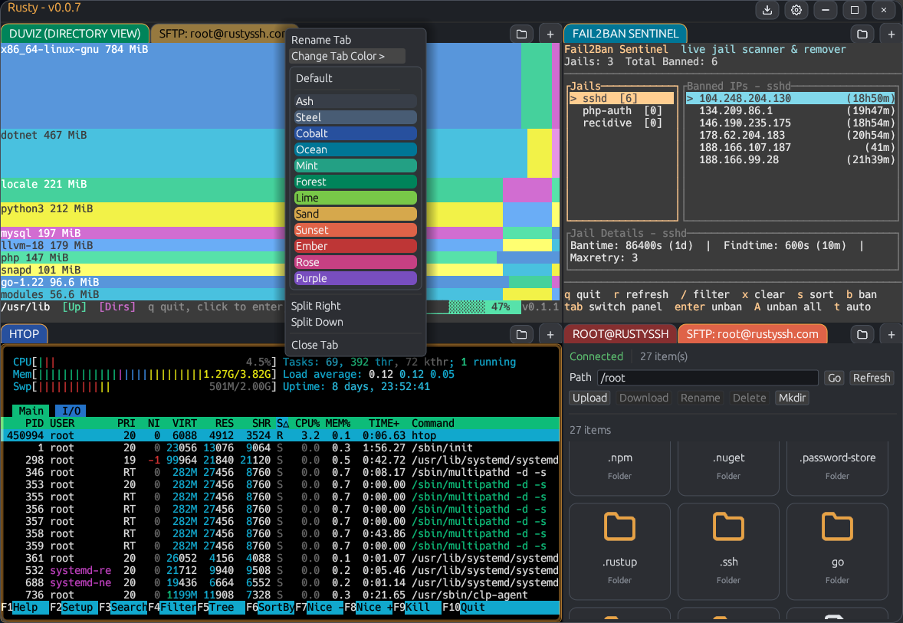

# Rusty

Rusty is a Windows desktop SSH client built in Rust with an embedded, tabbed terminal and a dockable layout (via `egui_tiles`).



## Features

### SSH and authentication
- Username/password login.
- Private-key login from a file path in each profile.
- Key passphrase prompt when needed, with optional per-profile passphrase saving.
- Keyboard-interactive auth (server prompts like password, OTP, etc.).
- Interactive PTY shell session with `TERM=xterm-256color`.
- Idle session keepalive (20s interval, no inactivity timeout).
- Connection/session logs written to `logs/tab-<id>.log`.

### Terminal behavior
- Embedded VT terminal rendering (xterm/VT100 escape handling).
- ANSI colors (16 + 256) with customizable base palette.
- Adjustable scrollback size (default 5000, configurable up to 200,000).
- Mouse wheel scrollback and a wider draggable scrollbar.
- Click-drag text selection, including selection across scrollback.
- Copy and paste support (including bracketed paste when remote app supports it).
- Terminal-style shortcuts:
  - `Ctrl+C` copies when text is selected, otherwise sends SIGINT.
  - `Ctrl+Shift+C` copies selection (or full visible screen if nothing is selected).
  - `Ctrl+V` / `Ctrl+Shift+V` pastes.
- Focus lock for terminal keys (arrows/tab/escape) so focus stays in the terminal.
- Active terminal pane highlight, plus optional dimming for inactive panes.

### Tabs, panes, and layout
- Multiple SSH sessions in tabs.
- `+` button opens a new tab (inherits active tab settings when available).
- Right-click `+` opens a new tab from a saved profile.
- Tab context menu:
  - Connect or disconnect (based on current state).
  - Rename tab.
  - Change tab color from presets.
  - Split right or split down.
  - Close tab.
- Delayed hover submenu for tab color picker.
- Dockable split layout using `egui_tiles`.
- Optional session layout restore (tabs/splits + active state) on launch.

### Settings and profiles
- Dedicated settings window with sections:
  - Autostart
  - Appearance
  - Terminal Colors
  - Profiles and Account
- Profile management:
  - Create, edit, save, and delete profiles.
  - Right-click profile actions: set default, clear default, delete.
  - Optional saved password per profile.
  - Optional saved key passphrase per profile.
- Connection fields:
  - Host, port, username, password, private key path.
  - Private key file browser.
- Default profile + autostart support.
- Appearance options:
  - Dark/light mode.
  - Theme file selection from `.thm` files.
  - Reload theme file without restarting.
  - Focus shade toggle for inactive terminals.
  - Terminal font size slider (live update).
  - Scrollback line count setting.
  - Minimize-to-tray toggle.
  - Save session layout toggle.
- Terminal color editor:
  - Background and foreground colors.
  - 16-color ANSI palette (normal + bright).
  - Dim/faint blend strength.

### Themes
- Loads UI theme files from `./theme` near the executable (and from current working directory fallback).
- Supports `Dark.thm` / `Light.thm` defaults plus selectable custom `.thm` files.
- Included theme pack in `dist/theme/`:
  - `Dark.thm`, `Light.thm`, `CrimsonDusk.thm`, `EmeraldMist.thm`, `ForestNight.thm`, `Graphite.thm`, `MidnightBlue.thm`, `MonochromeSlate.thm`, `OceanBreeze.thm`, `Sandstone.thm`, `SolarizedDark.thm`, `SolarizedLight.thm`.

### Window and tray
- Borderless custom window with rounded corners and custom title bar controls.
- Tray icon appears only when the app is minimized/hidden to tray.
- Single left-click on tray icon restores/raises the app.
- Tray menu actions: Show Rusty, Exit.
- Global cog menu for Connect, Disconnect, Settings, and Exit.

## Security Notes
- Config is stored per-user and encrypted on Windows using DPAPI (low CPU).
- If you choose to remember secrets (password / key passphrase), they are stored encrypted in the local config.
- Host key verification is currently permissive (server key is accepted without a `known_hosts` trust prompt).

## Config Location
- `%APPDATA%\\Rusty\\config.json`

## Build (Windows / MSVC)
```powershell
cargo build --release
```

## Run
```powershell
.\target\release\rusty.exe
```
