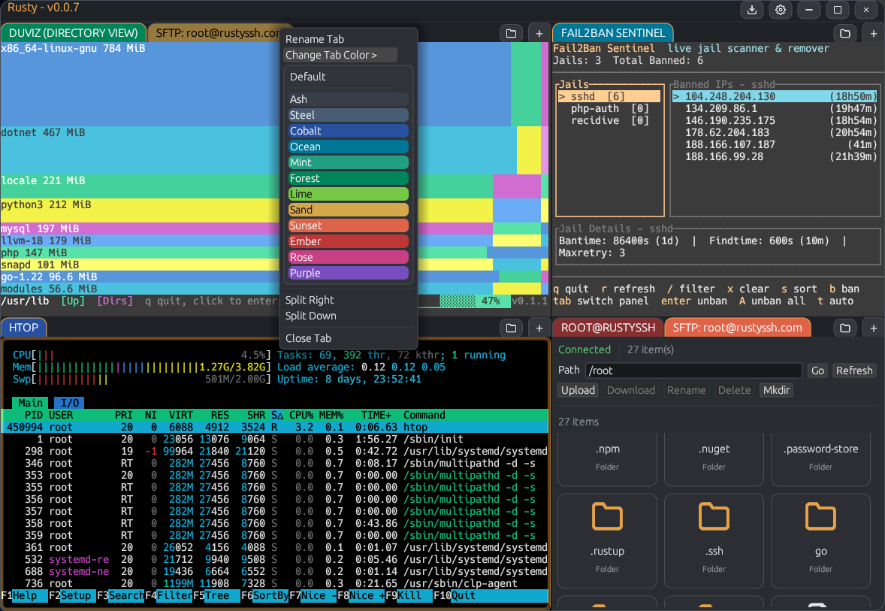
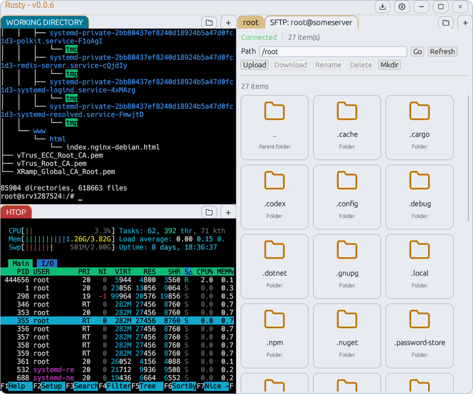
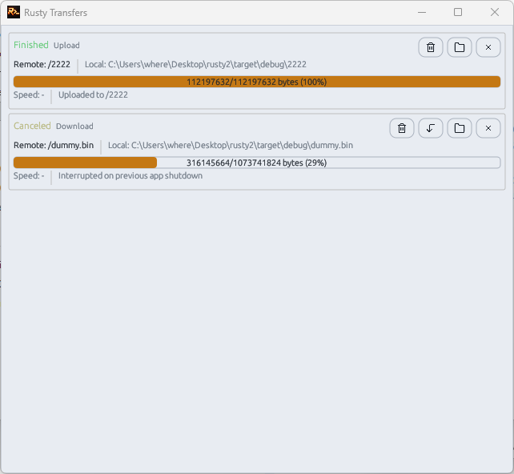

# Rusty

Rusty is a Windows SSH client built in Rust.

It focuses on:
- Tabbed and split-pane SSH sessions.
- Smooth terminal scrolling and copy/paste.
- Built-in SFTP file browser.
- Download/upload manager.
- Profile-based connections.
- Theme support.

Theme format details: [THEMES.md](THEMES.md)

## Screenshots

<p align="center">
  
  
  
</p>

## Build (Windows / MSVC)

```powershell
cargo build --release
```

## Install (Windows)

```powershell
winget install rusty
```

## Run

```powershell
.\target\release\rusty.exe
```
