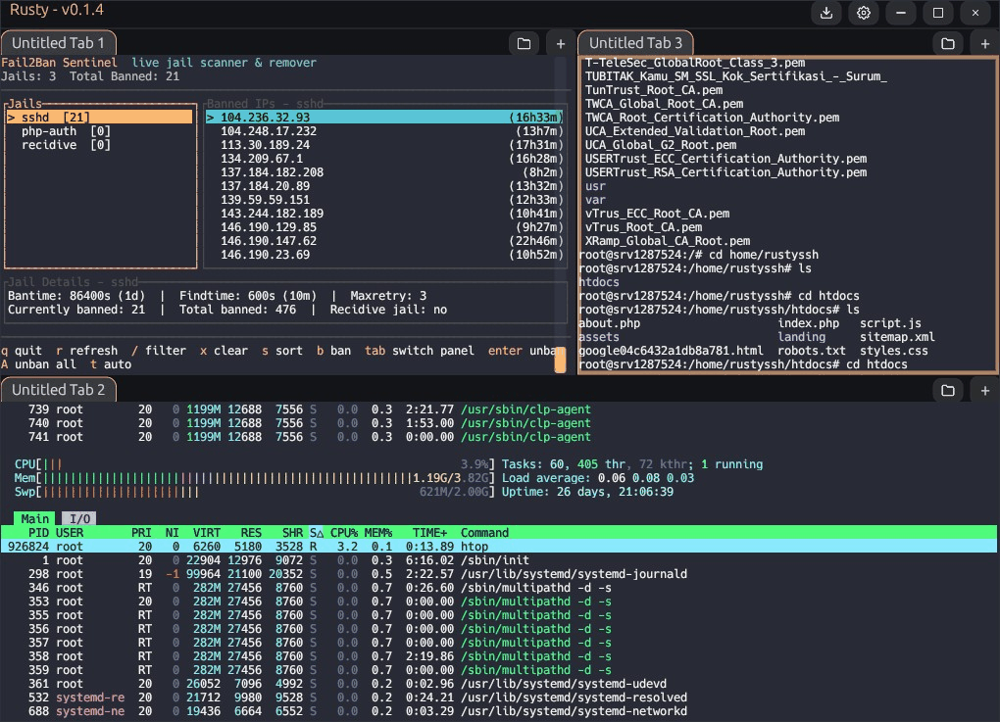

# Rusty

Rusty is a Windows SSH client built in Rust.

It focuses on:
- Tabbed and split-pane SSH sessions.
- Smooth terminal scrolling and copy/paste.
- Built-in SFTP file browser.
- Download/upload manager.
- Profile-based connections.
- Theme support.

## Theming

- UI chrome themes use `.thm` files in `./theme` (details: [THEMES.md](THEMES.md)).
- Terminal color themes use WezTerm-compatible TOML schemes in `./term` (for example `term/tokyo-night.toml`).

Terminal theme behavior:
- Open **Settings -> Terminal Colors** to browse scrollable theme cards.
- Click a card to apply immediately (including existing terminal sessions).
- Add your own `.toml` files to `./term`, then click **Reload from term/**.

WezTerm scheme reference:
- https://wezterm.org/config/lua/wezterm.color/load_scheme.html

## Screenshots

<p align="center">
  
  
  
</p>

## Build (Windows / MSVC)

```powershell
cargo build --release
```

## Install (Windows)

```powershell
winget install rusty
```

## Run

```powershell
.\target\release\rusty.exe
```
